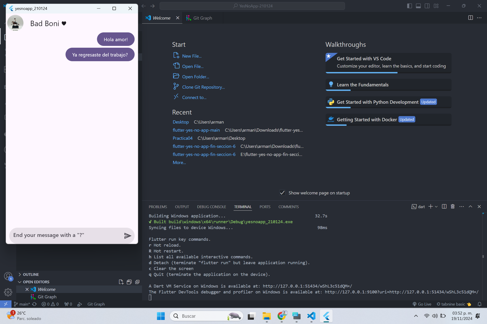
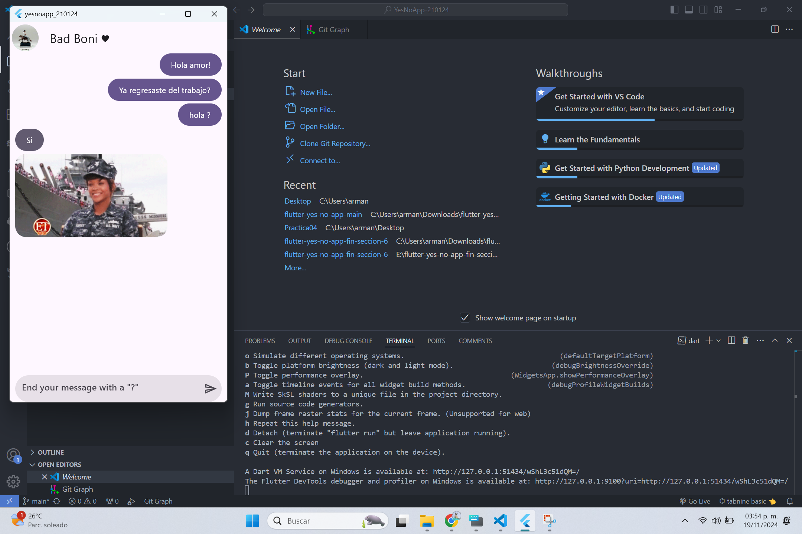

# YesNoApp-210124 readme
# yesnoapp_210124
### HISTORIAL DE PRACTICAS
|NO.|NOMBRE|POTENCIADOR|ESTATUS|
|--|--|--|--|
|22|Implementación de la UI para la Aplicación de Yes/No  |10|ACTIVA|
|23|Implementación de la Funcionalidad de la Aplicación de Yes/No|10|ACTIVA|

# REPORTE
<div style="display: flex; justify-content: space-between; align-items: center;">
  
  
</div>

# Práctica 23: Implementación de la Funcionalidad de la Aplicación Yes/No


## Datos del Estudiante
- **Alumno**: Armando Carrasco Vargas
- **Carrera**: Ingeniería en Desarrollo y Gestión de Software
- **Grado**: 10
- **Grupo**: A
- **Matrícula**: 210124

## Objetivo
Implementar una aplicación en Flutter que genere respuestas automáticas del tipo "Yes", "No" utilizando una API externa, y mostrar dichas respuestas con animaciones y stickers en un entorno interactivo.

## Descripción
La aplicación consiste en un contador interactivo que permite:
1. Consumo de la API
2. Visualización de gifs
3. Interactividad en la UI


## Código Fuente

```dart
import 'package:flutter/material.dart';
import 'package:yes_no_app/presentation/widgets/chat/her_message_bubble.dart';
import 'package:yes_no_app/presentation/widgets/chat/my_message_bubble.dart';
import 'package:yes_no_app/presentation/widgets/shared/message_field_box.dart';

class ChatScreen extends StatelessWidget {
  const ChatScreen({super.key});

  @override
  Widget build(BuildContext context) {
    return Scaffold(
      appBar: AppBar(
        leading: const Padding(
          padding: EdgeInsets.all(4.0),
          child: CircleAvatar(
            backgroundImage: NetworkImage(
                'https://www.stylist.co.uk/images/app/uploads/2022/06/01105352/jennifer-aniston-crop-1654077521-1390x1390.jpg?w=256&h=256&fit=max&auto=format%2Ccompress'),
          ),
        ),
        title: const Text('Mi amor ♥️'),
        centerTitle: false,
      ),
      body: _ChatView(),
    );
  }
}

class _ChatView extends StatelessWidget {
  @override
  Widget build(BuildContext context) {
    return SafeArea(
      child: Padding(
        padding: const EdgeInsets.symmetric(horizontal: 10),
        child: Column(
          children: [
            Expanded(
                child: ListView.builder(
                    itemCount: 100,
                    itemBuilder: (context, index) {
                      return ( index % 2 == 0 )
                        ? const HerMessageBubble()
                        : const MyMessageBubble();
                    })),

            /// Caja de texto de mensajes
            const MessageFieldBox(),
          ],
        ),
      ),
    );
  }
}
```
## Resultados

1 Generación de Respuestas

2 Se logró generar respuestas aleatorias del tipo "Yes", "No" y "Maybe".
Interfaz de Usuario Mejorada

3 respuestas se muestran en tarjetas con stickers animados, lo que mejora la experiencia del usuario.
Desplazamiento Automático

5 Al enviar un mensaje, la conversación se desplaza automáticamente al último mensaje.




    


### LISTA DE HERRAMIENTAS


### AUTOR
ELABORADO POR Armando Carrasco Vargas [@MandoCV](https://github.com/MandoCV)
